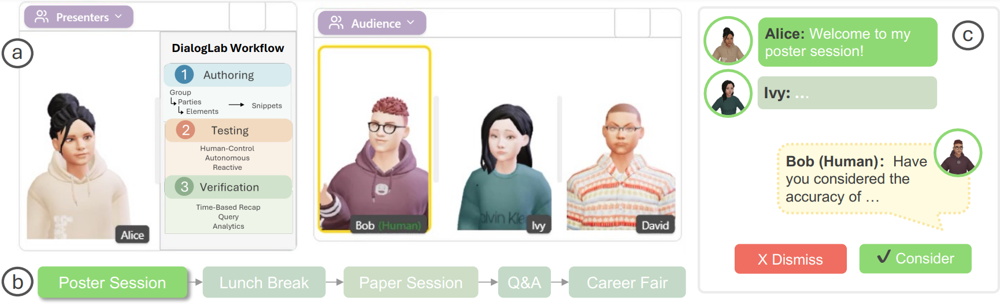

# DialogLab



[Paper](https://dl.acm.org/doi/10.1145/3746059.3747696) | [30s Preview](https://www.youtube.com/watch?v=AdvYhP8A51M) | [Video Figure](https://www.youtube.com/watch?v=U2Ag_Ktobzw) | [Web Demo](https://chatlab.3dvar.com/)

**DialogLab** is an authoring tool for configuring and orchestrating multi-agent conversations with animated 3D avatars. Built with React, Vite, and Express, it enables researchers, designers, and developers to create, visualize, and evaluate complex agent-based dialogue systems.

## Features

- **Visual Conversation Design**: Configure multi-agent conversations with an intuitive node-based editor
- **3D Avatar Integration**: Animate conversations using Ready Player Me avatars with synchronized speech
- **Multiple LLM Support**: Compatible with OpenAI GPT and Google Gemini models
- **Scene Management**: Create and manage multiple conversation scenarios
- **Real-time Preview**: Test and iterate on conversations in real-time
- **Verification Tools**: Analyze conversation metrics and quality
- **Experience Mode**: Present finished conversations in a polished viewer

## Prerequisites

- **Node.js** 18+ (Node 23 recommended for build and deploy scripts)
- **npm** 8+

## Repository Structure

```
DialogLab/
├── client/         # React UI (Vite) - Dev server on port 5173
│   ├── src/        # React components and application logic
│   └── public/     # Static assets (avatars, libraries)
└── server/         # Express API server - Listens on port 3010
    ├── providers/  # LLM provider integrations
    └── ...         # Core server logic
```

## Getting Started

### 1. Install Dependencies

```bash
# Install client dependencies
cd client
npm install

# Install server dependencies
cd ../server
npm install
```

### 2. Configure Environment Variables

Create a `.env` file in the `server/` directory with your API keys:

```env
# Core Configuration
NODE_ENV=development

# LLM Providers (configure at least one)
GEMINI_API_KEY=your-gemini-api-key-here
API_KEY_LLM=your-openai-api-key-here

# Defaults (optional)
DEFAULT_LLM_PROVIDER=gemini   # or openai
DEFAULT_OPENAI_MODEL=gpt-4
DEFAULT_GEMINI_MODEL=gemini-2.0-flash

# Text-to-Speech (optional - for avatar speech synthesis)
TTS_API_KEY=your-google-tts-api-key-here
TTS_ENDPOINT=https://eu-texttospeech.googleapis.com/v1beta1/text:synthesize
```

**Note**: You need at least one LLM provider API key (OpenAI or Gemini) to run conversations.

### 3. Start the Server

```bash
cd server
node server.js
```

The server will start at `http://localhost:3010`. You should see a message confirming the server is running.

### 4. Start the Client

In a separate terminal:

```bash
cd client
npm run dev
```

Open your browser and navigate to `http://localhost:5173`.

## Third-Party Components & Licenses

### TalkingHead (MIT License)
Portions of this project's code are adapted from the open-source project [TalkingHead](https://github.com/met4citizen/TalkingHead), © 2024 Mika Suominen (met4citizen), licensed under the MIT License.

**Files**: `client/public/libs/talkinghead.mjs`

### Three.js (MIT License)
This project uses [Three.js](https://threejs.org/) and its example modules, © 2010–present Three.js authors, licensed under the MIT License.

**License**: [Three.js LICENSE](https://github.com/mrdoob/three.js/blob/dev/LICENSE)

### Ready Player Me Avatars (Custom License)
Example avatar files (`client/public/assets/*.glb`) were created using [Ready Player Me](https://readyplayer.me/) and are subject to [Ready Player Me's Terms of Use](https://readyplayer.me/terms-of-use).

**Note**: These assets are provided for demonstration purposes only and are **not covered** by this project's open-source license. For production use, you must obtain your own avatars or comply with Ready Player Me's licensing terms.

## Citation

If you use DialogLab in your research, please cite our UIST 2025 paper:

```bibtex
@inproceedings{dialoglab2025,
author = {Hu, Erzhen and Chen, Yanhe and Li, Mingyi and Phadnis, Vrushank and Xu, Pingmei and Qian, Xun and Olwal, Alex and Kim, David and Heo, Seongkook and Du, Ruofei},
  title     = {DialogLab: Configuring and Orchestrating Multi-Agent Conversations},
  booktitle = {Proceedings of the 38th Annual ACM Symposium on User Interface Software and Technology (UIST '25)},
  year      = {2025},
  publisher = {Association for Computing Machinery},
  address   = {New York, NY, USA},
  doi       = {10.1145/3746059.3747696}
}
```
